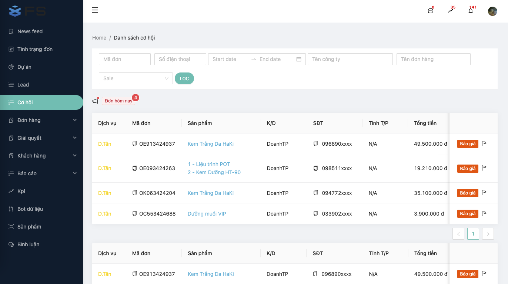
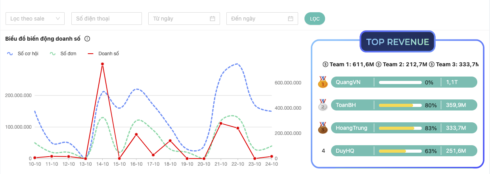
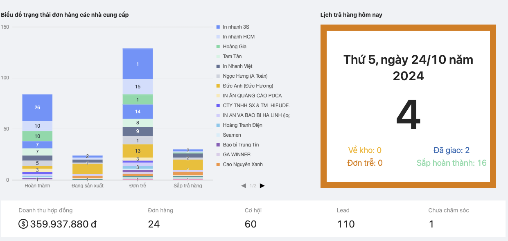
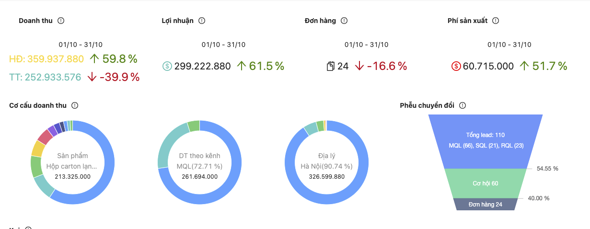
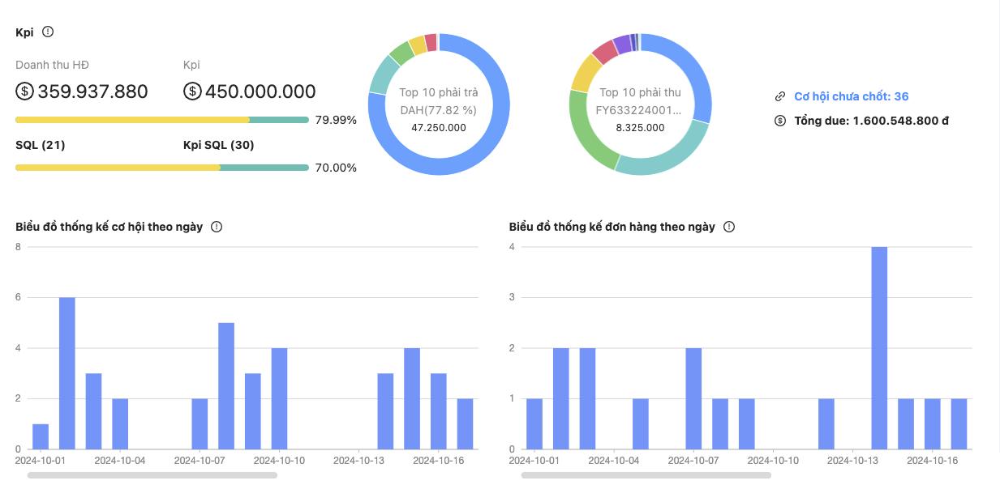
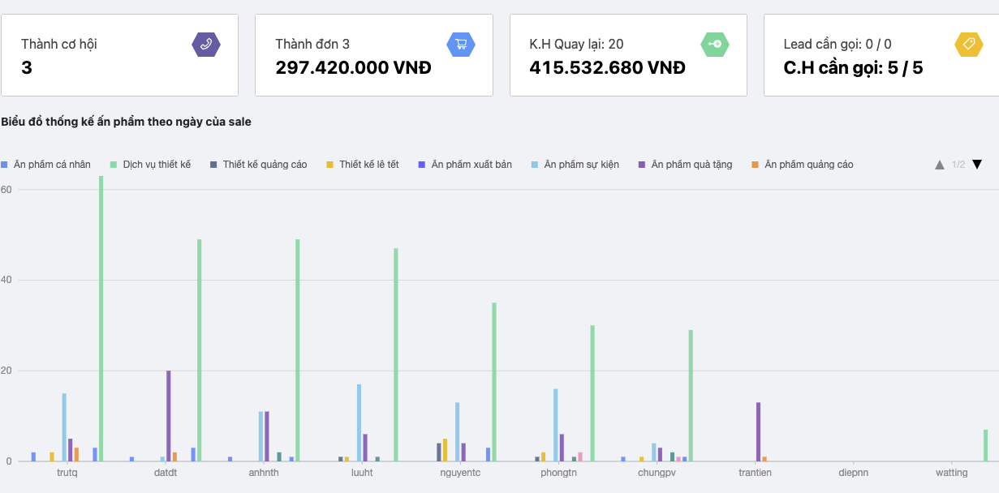
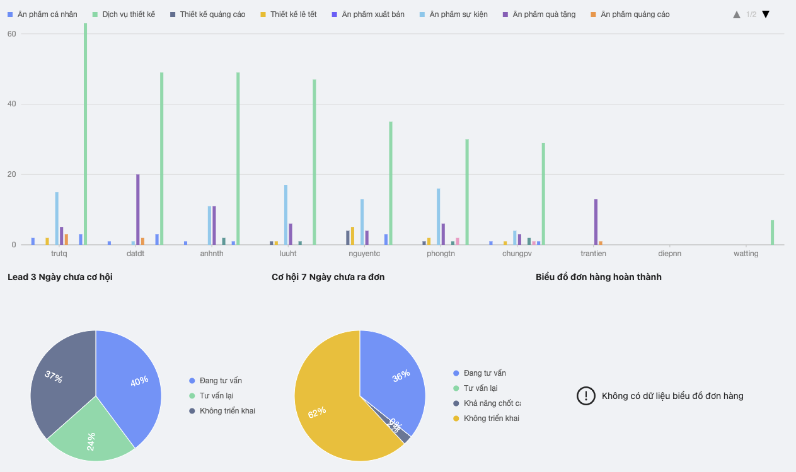

# Open-Cdp-Client

 

Dự án Open-Cdp được phát triển và duy trì bởi đội ngũ: Công ty Cổ Phần Flast-Solution 
(FS) [https://flast.vn].

## Kiến trúc Database [https://flast.vn/architectrue/database]
## Kiến trúc Backend [https://flast.vn/architectrue/java]
## Kiến trúc Frontend [https://flast.vn/architectrue/react-js]

1. Phân hệ Marketing: Thu thập dữ liệu từ nhiều nguồn khác nhau, tự động chia dữ liệu cho các kinh doanh theo nguyên tắc cân bằng.

2. Phân hệ bán hàng: Khi có dự liệu đã thu thập từ trước đó.
- Kinh doanh tạo cơ hội bán hàng, báo giá đơn hàng online
- Nhập thông tin thanh toán
- Kế toán duyệt tiền
- Đơn hàng được thành lập

3. Phân hệ sản xuất, điều phối đơn hàng:<br.> 
Với những doanh nghiệp cần điều phối quá trình sản xuất từ các nhà cung cấp khác thì sử dụng chức năng này để điều đơn cho các nhà cung cấp, theo dõi tiến độ sản xuất.

4. Phân hệ kho vận: 
- Quản lý kho
- Nhập kho
- Giao hàng

5. Phân hệ chăm sóc khách hàng Trước - Trong - Sau bán hàng:
- Chăm sóc khách hàng trước bán cho các dữ liệu 7 ngày không ra cơ hội
- Chăm sóc khách hàng 3 ngày từ cơ hội mà chưa ra đơn
- Chăm sóc khách hàng sau khi khách nhận được hàng và đơn hàng hoàn thành
- Đưa ra số liệu về hiệu quả của CSKH trong việc gia tăng doanh số

6. Phân hệ dự án và công việc của từng cá nhân trong dự án:  
- Chức năng được phát triên như một app nhắn tin, giúp doanh nghiệp lưu vết, tương tác với khách hàng thời gian thực.
- Lưu trữ File - Follow dự án

## Các Báo Cáo Marketting - Sale - Điều phối sản xuất - Kho vận - CSKH ##

  

  

  

  

  

  

  

  

    <a href="https://flast.vn/case-study"><code>Hệ thống bán lẻ, dịch vụ</code></a>
     • 
    <strong><code>$ CHi phí hệ thống CNTT</code></strong>
     • 
    
  

   
  Xây dựng hế thống CNTT để dịch chuyển công việc nên nền tảng số doanh nghiệp cần có hệ thống công nghệ thông tin, nhân sự công nghệ thông tin, chi phí có thể lên tới hàng trăm triệu đồng mỗi tháng.   
  Với giải pháp của Open-CDP doanh nghiệp chỉ cần một VPS với chi phí thấp chỉ khoảng 200.000 đ cũng có thể vận hành tốt.  
  Quan trọng hơn nữa là dữ liệu là của doanh nghiệp quản lý

## Lĩnh vực áp dụng ##

- Bán lẻ thời trang, điện tử ...
- Siêu thị mini
- Tạp hoá
- Nhà hàng dịch vụ ăn uống
- Khách sạn, nhà nghỉ
- Bất động sản
- Xuất nhập khẩu
- Quản lý tiến độ sản xuất
- Quản lý Nhà thuốc

## Lời kết ##

Flast-Solution luôn tích cực tham gia đóng góp cho sự nghiệp phát triển Công nghệ Thông tin của đất nước nói chung và của SMB nói riêng.  
Hướng tới đóng góp tích cực vào quá trình chuyển đối số của doanh nghiệp theo "Phương Châm" Nhanh - Hiệu quả - Tiết Kiệm.

Nếu bạn cần tư vấn về Xây dựng hệ thống CNTT thì đừng ngần ngại, hãy liên hệ với chúng tôi theo thông tin bên dưới:

- Mobile:   0987.938.491
- Email:    flast.vn@gmail.com

## Đội ngũ phát triển ##
HuuNV, TrungThanh, QuangDuc, Minh3N
